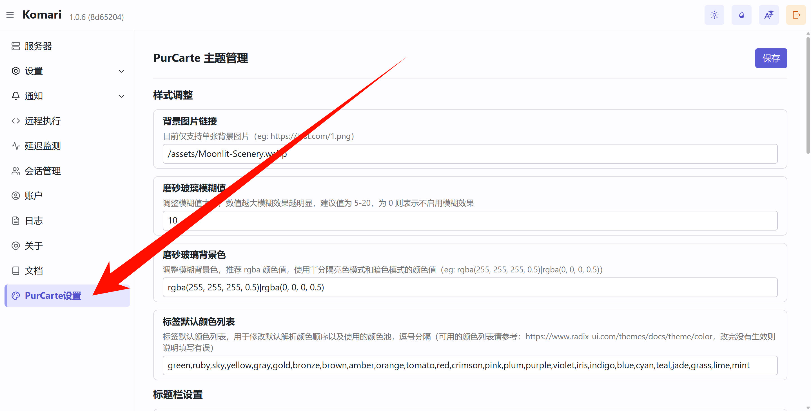

<div align="center">


## ✨ PurCarte ✨

一款为 [Komari](https://github.com/komari-monitor/komari) 设计的磨砂玻璃风格主题。

</div>

---

> [!NOTE]
> 本主题在 Gemini 的辅助下完成，融合了官方主题的部分设计与个人审美偏好，旨在提供一种简洁、美观的磨砂玻璃质感界面

## 🚀 快速开始

### 安装与启用

1.  前往 [Releases](https://github.com/Montia37/komari-theme-purcarte/releases) 页面下载最新的 `komari-theme-purcarte.zip` 文件。
2.  进入 Komari 后台，上传 `zip` 压缩包并启用本主题。

### 配置背景图片

> 为获得最佳视觉效果，建议搭配背景图片使用

#### Komari v1.0.5 及以上版本

如果 Komari 版本为 v1.0.5 或更高版本，可直接在 `Komari 后台 > PurCarte设置` 中配置背景图片等主题选项，无需手动添加自定义代码，如已添加自定义代码需要删去背景相关 style 避免干扰

#### 旧版本配置方法

<details>

对于旧版本，请在 `Komari 后台 > 设置 > 站点 > 自定义 Body` 处添加以下代码并保存：

```html
<style>
  /* 自定义背景图片 */
  body::before {
    content: "";
    position: fixed;
    top: 0;
    left: 0;
    width: 100%;
    height: 100%;
    z-index: -1;
    background: url(https://i.yon.li/w/682f73d97eade.png) center/cover no-repeat;
  }
</style>
```

</details>

## ⚙️ 主题配置



本主题支持通过 Komari 后台进行详细配置，所有可用选项如下：

#### 样式调整

| 名称 | 配置项 | 类型 | 默认值 | 说明 |
| :--- | :--- | :--- | :--- | :--- |
| 背景图片链接 | `backgroundImage` | `string` | `/assets/Moonlit-Scenery.webp` | 目前仅支持单张背景图片（eg: https://test.com/1.png ） |
| 启用视频背景 | `enableVideoBackground` | `switch` | `false` | 启用后将使用视频作为背景 |
| 视频背景链接 | `videoBackgroundUrl` | `string` | `/assets/LanternRivers_1080p15fps2Mbps3s.mp4` | 视频背景链接（eg: https://test.com/1.mp4 ），建议使用无声视频，且视频文件较大时可能会影响加载速度 |
| 启用磨砂玻璃效果 | `enableBlur` | `switch` | `true` | 启用后将使主要容器拥有磨砂玻璃效果 |
| 磨砂玻璃模糊值 | `blurValue` | `number` | `10` | 调整模糊值大小，数值越大模糊效果越明显，建议值为 5-20，为 0 则表示不启用模糊效果 |
| 磨砂玻璃背景色 | `blurBackgroundColor` | `string` | `rgba(255, 255, 255, 0.5)\|rgba(0, 0, 0, 0.5)` | 调整模糊背景色，推荐 rgba 颜色值，使用“\|”分隔亮色模式和暗色模式的颜色值（eg: rgba(255, 255, 255, 0.5)\|rgba(0, 0, 0, 0.5)） |
| 启用标签透明背景 | `enableTransparentTags` | `switch` | `true` | 启用后标签将使用较为透明的背景色，当背景情况复杂导致标签难以辨识时建议关闭 |
| 标签默认颜色列表 | `tagDefaultColorList` | `string` | `ruby,gray,gold,bronze,brown,yellow,amber,orange,tomato,red` | 标签默认颜色列表，展示的标签将按顺序调用该颜色池，逗号分隔（可用的颜色列表请参考：https://www.radix-ui.com/themes/docs/theme/color ，改完没有生效则说明填写有误） |
| 默认主题颜色 | `selectThemeColor` | `select` | `gray` | 设置默认主题颜色，颜色对照请参考：https://www.radix-ui.com/themes/docs/theme/color |
| 启用 localStorage 配置 | `enableLocalStorage` | `switch` | `true` | 启用后将优先使用用户浏览器本地配置的视图和外观设置。关闭后将强制使用下方的主题配置，本地可调整但刷新即恢复 |
| 默认展示视图 | `selectedDefaultView` | `select` | `grid` | 设置默认展示视图为网格或表格 |
| 默认外观 | `selectedDefaultAppearance` | `select` | `system` | 设置默认外观为浅色、深色或系统主题 |
| 状态卡片显示控制 | `statusCardsVisibility` | `string` | `currentTime:true,currentOnline:true,regionOverview:true,trafficOverview:true,networkSpeed:true` | 控制状态卡片的显示与隐藏，格式为 卡片名称:显示状态（true/false），多个卡片使用逗号分隔，支持的卡片名称包括 currentTime（当前时间）, currentOnline（当前在线）, regionOverview（点亮地区）, trafficOverview（流量概览）, networkSpeed（网络速率） |

#### 标题栏设置

| 名称 | 配置项 | 类型 | 默认值 | 说明 |
| :--- | :--- | :--- | :--- | :--- |
| 启用标题栏左侧 Logo | `enableLogo` | `switch` | `false` | 启用后默认在标题栏左侧显示 Logo |
| Logo 图片链接 | `logoUrl` | `string` | `/assets/logo.png` | Logo 图片链接（eg: https://test.com/logo.png） |
| 启用标题栏标题 | `enableTitle` | `switch` | `true` | 启用后默认在顶栏左侧显示标题 |
| 标题栏标题文本 | `titleText` | `string` | &nbsp; | 标题栏左侧显示的文本（留空则使用站点标题） |
| 启用搜索按钮 | `enableSearchButton` | `switch` | `true` | 启用后默认在标题栏右侧显示搜索按钮 |
| 启用管理按钮 | `enableAdminButton` | `switch` | `true` | 启用后默认在标题栏右侧显示管理按钮 |

#### 内容设置

| 名称 | 配置项 | 类型 | 默认值 | 说明 |
| :--- | :--- | :--- | :--- | :--- |
| 启用统计栏 | `enableStatsBar` | `switch` | `true` | 启用后默认显示统计栏 |
| 启用分组栏 | `enableGroupedBar` | `switch` | `true` | 启用后默认显示分组栏 |
| 启用 SWAP 显示 | `enableSwap` | `switch` | `true` | 启用后默认显示 SWAP 信息 |
| 流量进度条样式 | `selectTrafficProgressStyle` | `select` | `circular` | 设置流量进度条样式为 circular（环形）或 linear（线形） |
| 启用列表视图进度条 | `enableListItemProgressBar` | `switch` | `true` | 启用后列表视图中将会显示进度条来表示使用率 |

#### Instance 设置

| 名称 | 配置项 | 类型 | 默认值 | 说明 |
| :--- | :--- | :--- | :--- | :--- |
| 启用 Instance 详情信息 | `enableInstanceDetail` | `switch` | `true` | 启用后默认显示 Instance 详情 |
| 启用延迟图表 | `enablePingChart` | `switch` | `true` | 启用后默认显示延迟图表 |
| 启用连接断点 | `enableConnectBreaks` | `switch` | `false` | 启用后图表中的曲线将会跨过断点形成连续的线条，并使用半透明的垂直参考线来标记断点位置 |
| 延迟图表最大渲染点数 | `pingChartMaxPoints` | `number` | `0` | 设置延迟图表的最大渲染点数来优化图表渲染，0 表示不限制，推荐值为 2000 或更小的值 |

## 🛠️ 本地开发

1.  **克隆仓库**

    ```bash
    git clone https://github.com/Montia37/komari-theme-purcarte.git
    cd komari-theme-purcarte
    ```

2.  **安装依赖**

    ```bash
    yarn install
    ```

3.  **启动开发服务器**

    ```bash
    yarn dev
    ```

4.  在浏览器中打开 `http://localhost:5173` (或 Vite 提示的其他端口) 即可进行预览和调试。

## 📄 许可证

本项目采用 [MIT License](LICENSE) 授权。
